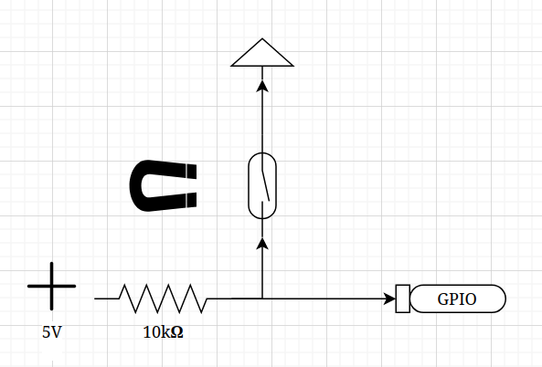

# ESP-Mailbox
This projekt is made for a ESP32C3 (could possibly work with other models) to report when a mailbox is opened. The accompanying backend can be found [here](https://github.com/Cosmao/Mailbox-backend).
### Implemented functions
 - Deep sleep
 - Wi-Fi
 - MQTT
 - Ultrasonic distance sensor (In its own branch)
### Project configuration
This project uses platformIO so we can access the configuration with: \
```pio run -t menuconfig``` 
| Option | Description |
| --- | --- |
| Wifi-config | Everything regarding the wifi connection can be found here |
| RTC Wakeup pin | What pin to use as RTC Wakeup pin. WARNING YOU NEED TO CHOOSE A RTC PIN, THERES NO CHECK THAT YOU SELECT A CORRECT ONE |
| RTC Timeout in seconds | How many seconds to wait for the RTC pin to go high to make sure the mailbox lid is closed |
| Timer wakeup in hours | How many hours between a timed wakeup to checkin to the backend to make sure connection and battery still work |
| MQTT Topic | What topic to send all messages on |
| MQTT QoS | What QoS to use for MQTT messages |
| MQTT endpoint | What endpoint to use |

All the normal espressif settings are there and should be looked over to adapt it to your ESP.
### RTC Notes
The RTC wake interrupt is designed as a pullup, I used the following schematic for the circuit:  \
Where the magnet was placed on the lid of the mailbox so the circuit goes high when the lid is opened and low when it is closed.
### Building and flashing
Building the project should be as simple as running ```pio run -t upload``` which will compile the code and then find a connected ESP and upload the code to it. Theres a lot of debug messages being printed by the ESP so reading those could help in case you have a problem.
